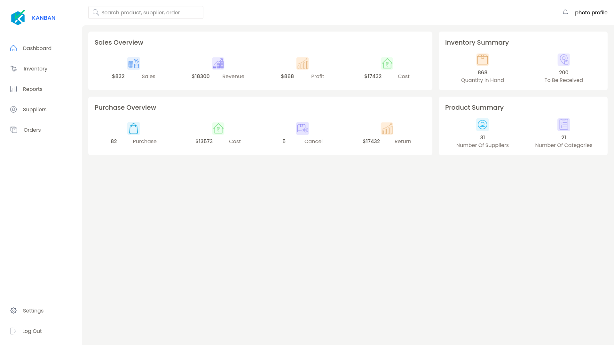

# Inventory Management System (WIP)



## 💡 Project Overview

This project is an **Inventory Management System** built using React and TypeScript. It aims to provide a user-friendly interface for managing inventory, tracking sales, purchases, and other related data. The application is currently under active development, with core functionalities being implemented.

## ✨ Features (Currently in Progress)

*   **Dashboard:** A central overview displaying key metrics such as revenue, profit, number of categories, number of suppliers, quantity in hand, sales, purchases, returns, and items to be received.
*   **Sidebar Navigation:** Intuitive navigation to different sections of the application.
*   **Topbar with Search:** A top navigation bar including a search functionality for quick access to information.
*   **Data Visualization:** Integration with chart configurations (though specific charts are still being developed).

*   **Component-Based Architecture:** Built with reusable React components for maintainability and scalability.

## 🛠️ Technologies Used

*   **React:** A JavaScript library for building user interfaces. ⚛️
*   **TypeScript:** A typed superset of JavaScript that compiles to plain JavaScript. 📝
*   **Vite:** A fast build tool that provides a lightning-fast development experience. ⚡
*   **Tailwind CSS:** A utility-first CSS framework for rapidly building custom designs. 💨

## 🚀 Installation and Setup

To get this project up and running on your local machine, follow these steps:

1.  **Clone the repository:**
    ```bash
    git clone https://github.com/Kholvra/inventory-managemnet-react
    cd inventory-managemnet-react
    ```
2.  **Install dependencies:**
    ```bash
    npm install
    # or
    yarn install
    ```
3.  **Run the development server:**
    ```bash
    npm run dev
    # or
    yarn dev
    ```
    The application will typically be available at `http://localhost:5173/` (or another port if 5173 is in use).

## 🚧 Project Status

This project is currently a **Work in Progress (WIP)**. Many features are still under development, and the application is not yet ready for production use. I am continuously working on adding new functionalities, refining the UI/UX, and improving overall performance.

## 🔮 Future Enhancements

*   Full CRUD (Create, Read, Update, Delete) operations for inventory items.
*   User authentication and authorization.
*   Detailed reporting and analytics.
*   Integration with a backend API for persistent data storage.
*   Improved responsiveness and mobile compatibility.

---

Thank you for checking out this project! Your feedback is welcome as it progresses. 🙏